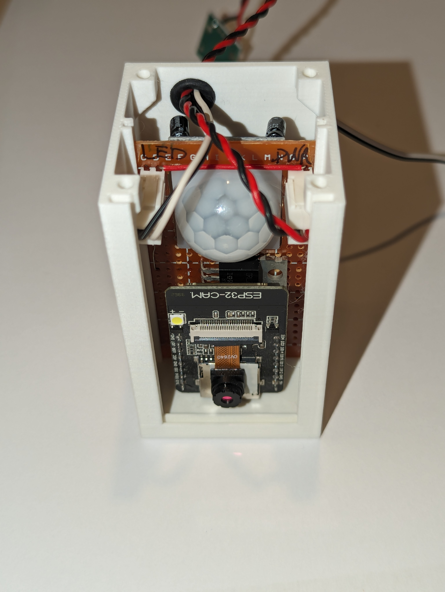
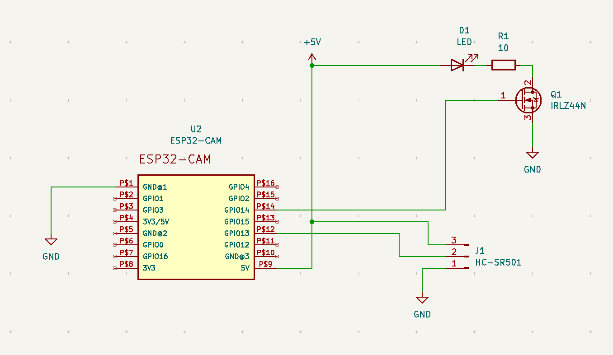
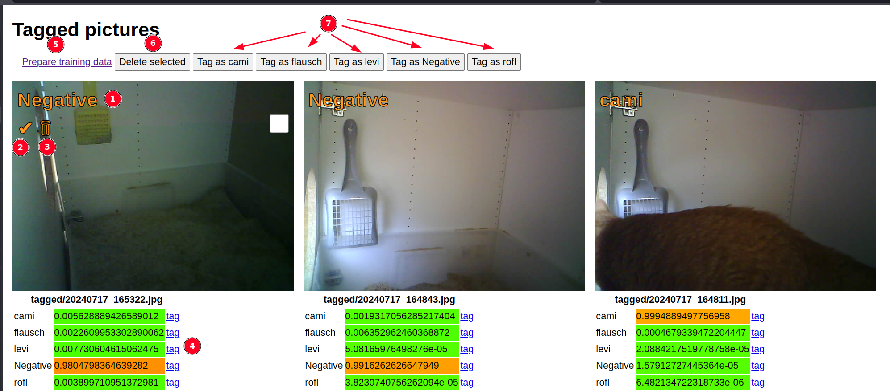

# SHICE - Sophisticated Helper Identifying Cat Entities

__The problem:__ You have a bunch of cats and as usual one of them is sick. The vet wants a stool sample of that cat. But you don't know, which poop belongs to which cat.

__The solution:__ SHICE

## What is SHICE
SHICE consists of cameras capturing images of the cats while using the litter boxes and sending those cameras to a server process where the cats are identified. After that a webhook is called for notification purpose.
My setup consists of ESP32 Cams in combination with HC-SR501 PIR sensors and the server process runs on the Raspberry Pi 4 that already runs Home Assistant. Home Assistant is also responsible for notifying me.

## Hardware
You find the 3D printed parts here: https://www.printables.com/model/945879-housing-for-esp32-cam-pir-sensor





Part list for the satellites:
- ESP32 Cam board
- HC-SR501
- optionally a MOSFET and a LED + current limiting resistor if you want to use the light option

On the server side everything that runs Python and TensorFlow lite should be fine.

## Software
### Satellites
Open the `arduino` folder in PlatformIO. Edit the platformio.ini to fit your needs. At least one environment is needed, but you can create multiple environments if you have more than one litter box. 
The first time you flash the ESP you have to use USB. After that you should be able to use OTA updates by setting `upload_port` and `upload_protocol` in the corresponding environment section.

Whenever the PIR sensor is triggered a new image will be captured and uploaded. Between consecutive images `timerInterval`ms will be waited. If you set the build flag `-D WEBHOOK="https://example.com/hook"` in platformio.ini this webhook will be called when an image is taken.

One might use this e.g. to be notified as soon as possible when an event happened even before the recognition is done. Or if you have multiple satellites this is a way to check, whicht satellite triggered the event.

### Server
```bash
git clone https://github.com/flurl/shice.git
cd shice/
python -m venv venv
source venv/bin/activate
pip install -r requirements.txt
```

You have to create a file named `secret.py`  with the following content:

```python
POST_PREDICTION_HOOK = "https://example.com/hook"
```

A POST request will be made to the hook's URL after the recognition has happend. The request has the parameter `label` where the parameters value is the tag returned from TensorFlow with the highest score.

## Obtaininig an AI model
You can use Microsoft's Custom Vision https://www.customvision.ai to train a model. Export it as TensorFlow lite and extract the zip file to the folder `tensorflow`.

## Running the server
Activate the venv and then run
```bash
python manage.py
```

## Gathering more data for machine learning
Whenever an image is uploaded to and tagged by the server that image is saved into the `tagged_images` folder along a JSON file containing the scores. You can control the images by visiting http://SERVER:PORT/list_tagged in your browser. 



1. The tag that has been associated with the image
2. Confirm the image was correctly tagged and move it to the training data
3. Delete the image
4. List of all scores for the individual tags. By clicking the corresponding "tag" link the tag can be manually set
5. Move all images to the training data
6. Delete all selected images
7. Manually set a specific tag for the selected images

After moving an image to the training data you'll find it in a sub-directory of the training folder named after the assigned tag.
